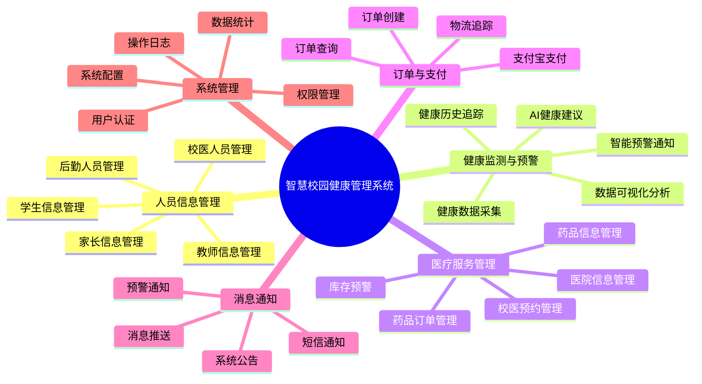

# 智慧校园健康管理系统需求说明书
## Software Requirements Specification (SRS)

---

**文档信息**
- **项目名称**: 智慧校园健康管理系统 (Smart Campus Health Management System)
- **项目代号**: SCHMS
- **文档版本**: v2.0.0
- **文档状态**: 正式发布
- **编写日期**: 2024年11月
- **密级**: 内部公开
- **编写团队**: 系统架构组
- **审核人**: 技术委员会
- **批准人**: 项目经理

---

## 文档修订历史

| 版本号 | 日期 | 修订人 | 修订内容 | 审核状态 |
|--------|------|--------|---------|---------|
| v1.0.0 | 2024-03 | 架构组 | 初始版本创建 | 已审核 |
| v1.5.0 | 2024-05 | 架构组 | 增加AI健康建议模块 | 已审核 |
| v2.0.0 | 2024-11 | 架构组 | 完整需求梳理与细化 | 已审核 |

---

## 目录

[TOC]

---

## 1. 引言

### 1.1 文档目的

本需求说明书(SRS)旨在全面、准确、详细地描述智慧校园健康管理系统的功能需求、性能需求、质量属性及约束条件,为后续的系统设计、开发、测试、部署和维护提供统一的参考标准。

**目标读者**:
- 系统架构师: 用于系统架构设计和技术选型
- 开发工程师: 用于功能实现和代码开发
- 测试工程师: 用于测试用例设计和验收标准制定
- 产品经理: 用于产品规划和需求管理
- 项目经理: 用于项目计划和资源调配
- 运维工程师: 用于系统部署和运维规划
- 最终用户: 用于理解系统功能和使用场景

**参考标准**:
- IEEE Std 830-1998: IEEE Recommended Practice for Software Requirements Specifications
- GB/T 9385-2008: 软件工程—软件需求规格说明书规范
- ISO/IEC 25010: 系统和软件质量模型

### 1.2 项目背景

#### 1.2.1 业务背景

随着"健康中国2030"战略的深入推进和教育信息化2.0行动计划的实施,校园健康管理正面临数字化转型的迫切需求。传统校园健康管理存在以下痛点:

**数据层面**:
- 健康数据采集依赖人工,效率低、准确性差
- 数据分散存储,缺乏统一管理平台
- 历史数据难以追溯,无法进行趋势分析
- 数据孤岛现象严重,各系统间数据不互通

**管理层面**:
- 健康异常发现滞后,预警机制不完善
- 家校沟通不及时,信息传递效率低
- 医疗资源调度困难,预约流程繁琐
- 药品库存管理粗放,缺乏精细化管理

**技术层面**:
- 缺乏物联网设备支持,无法实时监测
- 数据分析能力不足,无法提供智能建议
- 移动化程度低,用户体验欠佳
- 系统集成度低,重复建设严重

#### 1.2.2 项目价值

本系统通过物联网(IoT)、大数据、人工智能(AI)、云计算等先进技术,构建智能化、数字化的校园健康管理平台,实现:

**业务价值**:
- 提升健康数据采集效率90%以上
- 缩短健康异常响应时间至5分钟内
- 提高医疗资源利用率30%以上
- 降低人工管理成本50%以上
- 提升用户满意度至85分以上(满分100)

**技术价值**:
- 建立统一的健康数据标准和规范
- 构建可扩展的微服务架构体系
- 积累海量健康数据资产
- 形成可复制推广的解决方案

**社会价值**:
- 保障师生身体健康,降低健康风险
- 提升校园健康管理水平
- 促进教育信息化发展
- 为智慧城市建设提供参考

### 1.3 项目范围

#### 1.3.1 系统边界

**系统内**:
- 人员信息管理(学生、教师、家长、后勤、校医)
- 健康数据采集与存储
- 健康监测与智能预警
- 医疗服务管理(药品、医院、预约)
- 订单与支付处理
- 消息通知服务
- 系统管理与运维

**系统外**(外部系统集成):
- 智能穿戴设备(数据采集)
- 支付宝支付平台(支付服务)
- OpenAI平台(AI健康建议)
- 阿里云短信平台(短信通知)
- 学校现有教务系统(数据同步,可选)

#### 1.3.2 用户群体

| 用户角色 | 数量规模 | 主要职责 | 使用频率 |
|---------|---------|---------|---------|
| 学生 | 10,000+ | 健康数据主体,接受健康管理 | 每日多次 |
| 教师 | 500+ | 班级健康管理,预警处理 | 每日数次 |
| 家长 | 20,000+ | 关注子女健康,接收通知 | 每日数次 |
| 后勤人员 | 50+ | 药品管理,订单处理 | 每日多次 |
| 校医 | 10+ | 健康咨询,预约管理 | 每日多次 |
| 系统管理员 | 5+ | 系统配置,用户管理,数据维护 | 按需访问 |

#### 1.3.3 功能模块概览

```
智慧校园健康管理系统
├── 人员信息管理模块
│   ├── 学生信息管理
│   ├── 教师信息管理
│   ├── 家长信息管理
│   ├── 后勤人员管理
│   └── 校医人员管理
├── 健康监测与预警模块
│   ├── 健康数据采集
│   ├── 健康数据查询与可视化
│   ├── 健康历史记录
│   ├── 智能健康预警
│   └── AI健康建议
├── 医疗服务管理模块
│   ├── 药品信息管理
│   ├── 医院信息管理
│   ├── 药品医院关联管理
│   ├── 校医预约管理
│   └── 药品库存预警
├── 订单与支付模块
│   ├── 药品订单管理
│   ├── 员工订单管理
│   ├── 支付宝支付集成
│   └── 物流管理
├── 消息通知模块
│   ├── 系统公告通知
│   ├── 健康预警通知
│   ├── 短信通知服务
│   └── 消息推送管理
└── 系统管理模块
    ├── 用户认证与授权
    ├── 角色权限管理
    ├── 操作日志审计
    ├── 数据统计分析
    └── 系统配置管理
```

### 1.4 术语与缩略语

#### 1.4.1 业务术语

| 术语 | 英文 | 定义 | 说明 |
|------|------|------|------|
| 健康数据 | Health Data | 用户的生理指标数据 | 包括身高、体重、心率、血氧、体温、睡眠、步数等 |
| BMI | Body Mass Index | 身体质量指数 | 计算公式: 体重(kg) / 身高²(m) |
| SpO2 | Blood Oxygen Saturation | 血氧饱和度 | 正常值95%-100% |
| 健康预警 | Health Alert | 健康指标异常提醒 | 当指标超出正常范围时自动触发 |
| 智能终端 | Smart Device | 健康数据采集设备 | 如智能手环、健康监测仪等 |
| 设备ID | Device ID | 终端设备唯一标识 | 用于关联用户与设备 |
| 校医 | School Doctor | 校园医务人员 | 提供基础医疗服务 |
| 预约 | Reservation | 校医咨询预约 | 学生/教师预约校医服务 |
| 药品库存 | Drug Inventory | 校医室药品存量 | 实时监控和管理 |

#### 1.4.2 技术术语

| 缩略语 | 全称 | 说明 |
|--------|------|------|
| SRS | Software Requirements Specification | 软件需求规格说明书 |
| RBAC | Role-Based Access Control | 基于角色的访问控制 |
| REST | Representational State Transfer | 表述性状态转移 |
| API | Application Programming Interface | 应用程序编程接口 |
| ORM | Object-Relational Mapping | 对象关系映射 |
| CRUD | Create, Read, Update, Delete | 增删改查操作 |
| IoT | Internet of Things | 物联网 |
| AI | Artificial Intelligence | 人工智能 |
| JWT | JSON Web Token | JSON Web令牌 |
| MD5 | Message Digest Algorithm 5 | 消息摘要算法5 |
| SSL/TLS | Secure Sockets Layer/Transport Layer Security | 安全套接层/传输层安全 |
| SLA | Service Level Agreement | 服务级别协议 |
| RTO | Recovery Time Objective | 恢复时间目标 |
| RPO | Recovery Point Objective | 恢复点目标 |

### 1.5 参考资料

#### 1.5.1 标准规范
- IEEE Std 830-1998: IEEE推荐软件需求规格说明书实践
- GB/T 9385-2008: 软件工程—软件需求规格说明书规范
- ISO/IEC 25010: 系统和软件质量模型
- GB/T 22239-2019: 信息安全技术网络安全等级保护基本要求
- GB/T 35273-2020: 信息安全技术个人信息安全规范

#### 1.5.2 技术文档
- Spring Boot 3.2.4 官方文档
- Vue 3.2 官方文档
- Element Plus 2.2 组件文档
- MyBatis-Plus 3.5 官方文档
- MySQL 8.0 参考手册
- Redis 设计与实现
- Sa-Token 权限认证框架文档
- OpenAI API 官方文档
- 支付宝开放平台文档
- 阿里云短信服务文档

#### 1.5.3 行业标准
- 健康中国2030规划纲要
- 教育信息化2.0行动计划
- 学校卫生工作条例
- 中小学健康教育指导纲要

---

## 2. 系统概述

### 2.1 产品视角

智慧校园健康管理系统是一个面向教育行业的垂直领域SaaS平台,采用B/S架构设计,基于微服务架构思想,实现前后端分离。系统定位为校园健康管理的数字化底座,可与学校现有信息系统(如教务系统、学籍系统)进行数据集成。

**系统定位**:
- 校园健康管理的统一平台
- 健康数据的统一采集和存储中心
- 智能预警的决策支撑系统
- 医疗服务的协同平台

**技术架构视图**:

```
┌─────────────────────────────────────────────────────────────────┐
│                      前端展示层 (Presentation Layer)              │
│   Vue3 + TypeScript + Element Plus + ECharts + Vite             │
└─────────────────────────────────────────────────────────────────┘
                              ▼ HTTPS/WSS
┌─────────────────────────────────────────────────────────────────┐
│                      API网关层 (API Gateway)                      │
│           路由、负载均衡、限流、熔断、日志、监控                    │
└─────────────────────────────────────────────────────────────────┘
                              ▼ HTTP/RPC
┌─────────────────────────────────────────────────────────────────┐
│                    业务服务层 (Business Service Layer)            │
│  ┌─────────────┐  ┌─────────────┐  ┌─────────────┐             │
│  │人员管理服务 │  │健康监测服务 │  │医疗服务管理 │             │
│  └─────────────┘  └─────────────┘  └─────────────┘             │
│  ┌─────────────┐  ┌─────────────┐  ┌─────────────┐             │
│  │订单支付服务 │  │消息通知服务 │  │系统管理服务 │             │
│  └─────────────┘  └─────────────┘  └─────────────┘             │
│           Spring Boot 3.2.4 + MyBatis-Plus 3.5.5                │
└─────────────────────────────────────────────────────────────────┘
                              ▼ JDBC/Redis Protocol
┌─────────────────────────────────────────────────────────────────┐
│                     数据持久层 (Data Layer)                       │
│      ┌──────────────────┐         ┌──────────────────┐          │
│      │   MySQL 8.0      │         │     Redis        │          │
│      │  (主数据库)       │         │   (缓存/会话)     │          │
│      └──────────────────┘         └──────────────────┘          │
└─────────────────────────────────────────────────────────────────┘
                              ▼ HTTP/MQTT
┌─────────────────────────────────────────────────────────────────┐
│                   外部系统集成层 (External Integration)           │
│  ┌─────────────┐  ┌─────────────┐  ┌─────────────┐             │
│  │智能穿戴设备 │  │支付宝支付   │  │  OpenAI     │             │
│  └─────────────┘  └─────────────┘  └─────────────┘             │
│  ┌─────────────┐  ┌─────────────┐                               │
│  │阿里云短信   │  │  教务系统   │                               │
│  └─────────────┘  └─────────────┘                               │
└─────────────────────────────────────────────────────────────────┘
```

### 2.2 产品功能

系统提供六大核心功能模块,覆盖校园健康管理的全生命周期:

#### 2.2.1 功能全景图



#### 2.2.2 核心业务流程

**健康监测与预警流程**:
```
智能设备采集数据 → 数据实时上传 → 数据验证与存储 → 
预警规则引擎分析 → 异常检测 → 触发预警 → 
多渠道通知(系统通知+短信) → 相关人员处理 → 闭环管理
```

**药品订单支付流程**:
```
用户浏览药品 → 选择药品下单 → 创建订单 → 
选择支付方式 → 跳转支付宝 → 完成支付 → 
支付回调 → 订单状态更新 → 后勤处理 → 
药品配送 → 确认收货 → 订单完成
```

### 2.3 用户特征

#### 2.3.1 用户画像

**学生用户**:
- **年龄**: 7-18岁(小学至高中)
- **技术水平**: 中等,熟悉移动设备操作
- **使用场景**: 查看健康数据、接收预警、预约校医、购买药品
- **使用频率**: 每日3-5次
- **期望**: 界面简洁、操作简单、响应快速

**教师用户**:
- **年龄**: 25-60岁
- **技术水平**: 中等,部分教师技术能力较弱
- **使用场景**: 查看班级学生健康状况、处理预警、发布通知
- **使用频率**: 每日2-3次
- **期望**: 信息准确、功能实用、操作便捷

**家长用户**:
- **年龄**: 30-50岁
- **技术水平**: 中低,部分家长不熟悉智能设备
- **使用场景**: 查看子女健康数据、接收预警通知
- **使用频率**: 每日1-2次
- **期望**: 信息及时、通知准确、易于理解

**后勤人员**:
- **年龄**: 25-55岁
- **技术水平**: 中等
- **使用场景**: 管理药品库存、处理订单、配送药品
- **使用频率**: 每日10+次
- **期望**: 功能高效、流程顺畅、数据准确

**校医**:
- **年龄**: 30-60岁
- **技术水平**: 中等
- **使用场景**: 管理预约、查看健康数据、提供健康建议
- **使用频率**: 每日5-10次
- **期望**: 信息全面、决策支持、操作高效

**系统管理员**:
- **年龄**: 25-45岁
- **技术水平**: 高,具备专业IT技能
- **使用场景**: 用户管理、权限配置、系统监控、数据维护
- **使用频率**: 按需访问
- **期望**: 功能强大、灵活配置、监控完善

#### 2.3.2 用户权限矩阵

| 功能模块 | 学生 | 教师 | 家长 | 后勤 | 校医 | 管理员 |
|---------|------|------|------|------|------|--------|
| 查看自身健康数据 | ✓ | ✓ | - | - | - | ✓ |
| 查看关联人健康数据 | - | ✓ | ✓ | - | ✓ | ✓ |
| 接收健康预警 | ✓ | ✓ | ✓ | - | ✓ | ✓ |
| 预约校医 | ✓ | ✓ | - | - | - | - |
| 购买药品 | ✓ | ✓ | - | - | - | - |
| 管理药品 | - | - | - | ✓ | - | ✓ |
| 处理订单 | - | - | - | ✓ | - | ✓ |
| 发布通知 | - | - | - | - | - | ✓ |
| 用户管理 | - | - | - | - | - | ✓ |
| 系统配置 | - | - | - | - | - | ✓ |

### 2.4 运行环境

#### 2.4.1 硬件环境

**服务器端**:
- **生产环境**:
  - CPU: Intel Xeon 8核及以上或同等性能
  - 内存: 16GB及以上(建议32GB)
  - 硬盘: 500GB SSD及以上
  - 网络: 100Mbps专线及以上
  - 服务器数量: 建议2台(主备)

- **开发/测试环境**:
  - CPU: 4核及以上
  - 内存: 8GB及以上
  - 硬盘: 100GB及以上
  - 网络: 10Mbps及以上

**客户端**:
- PC端: 支持Windows 7+、macOS 10.12+、主流Linux发行版
- 移动端: 支持iOS 12+、Android 8.0+
- 屏幕分辨率: 最低1366×768,推荐1920×1080

#### 2.4.2 软件环境

**服务器端**:
- **操作系统**: 
  - 生产环境: CentOS 7.6+/Ubuntu 20.04 LTS+(推荐)
  - Windows Server 2016+(可选)
- **Java运行环境**: OpenJDK 17 或 Oracle JDK 17
- **数据库**: MySQL 8.0.28+
- **缓存**: Redis 5.0+
- **Web服务器**: Nginx 1.18+(可选,用于反向代理)
- **容器**: Docker 20.10+(可选)

**客户端**:
- **浏览器**(建议使用最新版本):
  - Google Chrome 90+
  - Mozilla Firefox 88+
  - Microsoft Edge 90+
  - Safari 14+ (macOS/iOS)
- **屏幕阅读器**(无障碍支持):
  - NVDA (Windows)
  - VoiceOver (macOS/iOS)

#### 2.4.3 网络环境

- **带宽要求**: 服务器出口带宽≥100Mbps
- **并发连接**: 支持10,000+并发连接
- **网络协议**: HTTP/1.1、HTTP/2、WebSocket
- **安全协议**: TLS 1.2+
- **域名**: 需要备案的独立域名
- **防火墙**: 开放80(HTTP)、443(HTTPS)、8081(后端API,可配置)端口

#### 2.4.4 外部依赖

| 外部系统 | 用途 | 必需性 | 依赖版本 |
|---------|------|--------|---------|
| 智能穿戴设备 | 健康数据采集 | 可选 | 支持HTTP/MQTT协议 |
| 支付宝开放平台 | 在线支付 | 必需 | SDK 4.22+ |
| OpenAI API | AI健康建议 | 必需 | API v1 |
| 阿里云短信 | 短信通知 | 可选 | SDK 2.0+ |
| 学校教务系统 | 数据同步 | 可选 | RESTful API |

### 2.5 设计与实现约束

#### 2.5.1 技术约束

**开发技术栈**:
- 后端开发语言: Java 17
- 前端开发语言: TypeScript、JavaScript (ES6+)
- 后端框架: Spring Boot 3.2.4
- 前端框架: Vue 3.2.39
- UI组件库: Element Plus 2.2.21
- ORM框架: MyBatis-Plus 3.5.5
- 数据库: MySQL 8.0.28
- 缓存: Redis
- 构建工具: Maven (后端)、Vite (前端)

**架构约束**:
- 采用B/S架构
- 前后端分离设计
- RESTful API设计风格
- 数据库采用单库设计(可扩展为分库分表)
- 支持水平扩展

#### 2.5.2 标准规范约束

- 遵循GB/T 22239-2019网络安全等级保护(建议达到二级)
- 遵循GB/T 35273-2020个人信息安全规范
- 遵循W3C Web标准
- 遵循WCAG 2.1无障碍标准(AA级)
- 遵循阿里巴巴Java开发手册
- 遵循Vue.js风格指南
- 遵循RESTful API设计规范

#### 2.5.3 业务约束

- 系统服务时间: 7×24小时不间断服务
- 数据保留期限: 用户数据永久保留,日志数据保留1年
- 隐私保护: 健康数据仅授权用户可见
- 审计要求: 关键操作必须记录审计日志
- 备份要求: 每日自动备份,保留最近30天备份

#### 2.5.4 项目约束

- 开发周期: 按项目计划执行
- 预算: 按项目预算控制
- 团队规模: 后端3-5人,前端2-3人,测试2人,运维1人
- 交付物: 源代码、技术文档、用户手册、测试报告、部署手册

---

## 3. 功能需求详细说明

### 3.1 人员信息管理模块

本模块负责管理系统中所有用户的基本信息,包括学生、教师、家长、后勤人员和校医五类用户。采用统一的用户管理框架,支持用户的全生命周期管理。

#### 3.1.1 学生信息管理

**功能编号**: FR-USER-001  
**优先级**: 高  
**用例名称**: 学生信息管理

##### 3.1.1.1 功能描述

对学生基本信息进行全生命周期管理,包括学生档案的新增、修改、删除、查询等操作,支持批量导入导出,是系统的核心基础功能。

##### 3.1.1.2 参与者

- **主要参与者**: 系统管理员
- **次要参与者**: 教务人员
- **受益者**: 学生、教师、家长

##### 3.1.1.3 前置条件

1. 用户已登录系统
2. 用户具有学生管理权限
3. 系统处于正常运行状态

##### 3.1.1.4 后置条件

1. 学生信息成功保存到数据库
2. 操作日志已记录
3. 如有关联数据(如健康数据),已建立关联关系

##### 3.1.1.5 基本流程

**新增学生**:
```
1. 管理员点击"新增学生"按钮
2. 系统显示学生信息录入表单
3. 管理员输入学生信息:
   - 基本信息: 学号、姓名、性别、出生日期、班级、年级
   - 联系信息: 手机号
   - 关联信息: 家长ID、班主任ID、设备ID
   - 账号信息: 初始密码
4. 系统验证数据:
   - 学号唯一性检查
   - 手机号格式验证
   - 必填项完整性检查
5. 验证通过后,系统:
   - 对密码进行MD5+盐值加密
   - 设置用户类型为"学生"
   - 设置用户状态为"正常"(status=1)
   - 记录创建时间和更新时间
   - 保存到数据库
6. 系统记录操作日志
7. 系统显示"添加成功"提示信息
8. 系统刷新学生列表
```

**查询学生**:
```
1. 管理员访问学生管理页面
2. 系统显示学生列表(支持分页)
3. 管理员可选择查询条件:
   - 按姓名模糊查询
   - 按学号精确查询
   - 按班级筛选
   - 按年级筛选
   - 按手机号查询
4. 系统根据条件执行查询
5. 系统展示查询结果(支持分页)
6. 管理员可点击查看学生详情
```

**修改学生信息**:
```
1. 管理员在学生列表中选择要修改的学生
2. 系统显示学生信息编辑表单(预填充当前数据)
3. 管理员修改信息
4. 系统验证数据合法性
5. 验证通过后,系统:
   - 更新数据库记录
   - 更新update_time字段
   - 记录操作日志
6. 系统显示"修改成功"提示
```

**删除学生**:
```
1. 管理员在学生列表中选择要删除的学生
2. 系统弹出确认对话框
3. 管理员确认删除
4. 系统检查是否有关联数据(如健康记录、订单等)
5. 如有关联数据,系统提示是否级联删除
6. 确认后,系统:
   - 删除学生记录(或标记为删除)
   - 处理关联数据
   - 记录操作日志
7. 系统显示"删除成功"提示
```

**批量导入**:
```
1. 管理员点击"批量导入"按钮
2. 系统显示文件上传界面,并提供Excel模板下载
3. 管理员上传Excel文件
4. 系统解析Excel文件:
   - 验证文件格式
   - 验证数据完整性
   - 检查学号重复
5. 系统展示预览界面,显示待导入数据
6. 管理员确认导入
7. 系统执行批量插入:
   - 采用事务处理
   - 失败自动回滚
8. 系统生成导入报告:
   - 成功数量
   - 失败数量
   - 失败原因明细
9. 系统记录操作日志
```

##### 3.1.1.6 扩展流程

**E1: 学号已存在**
```
at step 4: 学号唯一性检查失败
1. 系统提示"学号已存在,请检查后重新输入"
2. 系统高亮显示学号输入框
3. 返回step 3
```

**E2: 手机号格式错误**
```
at step 4: 手机号格式验证失败
1. 系统提示"手机号格式不正确,请输入11位有效手机号"
2. 系统高亮显示手机号输入框
3. 返回step 3
```

**E3: 删除失败(存在关联数据)**
```
at step 4: 检测到关联数据
1. 系统提示"该学生存在关联的健康数据/订单数据,是否确认删除?"
2a. 用户选择"确认": 执行级联删除
2b. 用户选择"取消": 取消删除操作
```

##### 3.1.1.7 输入输出

**输入**:

| 字段名 | 类型 | 长度 | 必填 | 说明 | 验证规则 |
|--------|------|------|------|------|---------|
| student_id | String | 32 | 是 | 学号 | 唯一,不可重复 |
| name | String | 32 | 是 | 姓名 | 2-32个字符 |
| sex | String | 2 | 是 | 性别 | 男/女 |
| birth | String | 10 | 否 | 出生日期 | YYYY-MM-DD格式 |
| phone | String | 11 | 是 | 手机号 | 11位数字 |
| grade | String | 32 | 是 | 年级 | 如"一年级""高三" |
| clazz | String | 32 | 是 | 班级 | 如"1班""高三1班" |
| parent_id | String | 32 | 否 | 家长ID | 关联家长表 |
| teacher_id | String | 32 | 否 | 班主任ID | 关联教师表 |
| device_id | String | 32 | 否 | 设备ID | 关联智能设备 |
| password | String | 64 | 是 | 密码 | 6-32位,MD5加密后存储 |
| image | String | 255 | 否 | 头像URL | 合法URL |

**输出**:

```json
{
  "code": 200,
  "message": "操作成功",
  "data": {
    "id": 1001,
    "studentId": "2024001",
    "name": "张三",
    "sex": "男",
    "birth": "2010-05-15",
    "phone": "13800138000",
    "grade": "初一",
    "clazz": "1班",
    "parentId": "P2024001",
    "parentName": "张XX",
    "teacherId": "T2024001",
    "teacherName": "李老师",
    "deviceId": "DEV001",
    "status": 1,
    "createTime": "2024-03-01 10:00:00",
    "updateTime": "2024-03-01 10:00:00"
  }
}
```

##### 3.1.1.8 业务规则

1. **BR-USER-001**: 学号必须唯一,不允许重复
2. **BR-USER-002**: 密码采用MD5+盐值加密存储,盐值随机生成
3. **BR-USER-003**: 新增学生默认状态为正常(status=1)
4. **BR-USER-004**: 删除学生时,如存在关联健康数据,需提示用户确认
5. **BR-USER-005**: 学生信息修改后,update_time自动更新为当前时间
6. **BR-USER-006**: 批量导入时,如部分数据失败,成功的数据仍然导入
7. **BR-USER-007**: 学生可关联一个或多个家长
8. **BR-USER-008**: 每个学生只能关联一个班主任
9. **BR-USER-009**: 每个学生可关联一个智能设备(一对一)

##### 3.1.1.9 非功能需求

- **性能**: 
  - 单次查询响应时间≤500ms
  - 批量导入1000条数据≤10秒
  - 支持10万+学生数据存储
- **可用性**: 
  - 功能可用率≥99.9%
  - 界面操作简单,3次点击内完成操作
- **安全性**: 
  - 密码加密存储
  - 操作日志记录
  - 敏感信息脱敏显示

##### 3.1.1.10 接口定义

**API接口**:

```
POST   /student              新增学生
GET    /student              查询学生列表(分页)
GET    /student2             查询所有学生(不分页)
GET    /searchStudent        根据条件搜索学生
PUT    /student              更新学生信息
DELETE /student/{sid}        删除学生
GET    /getStudentTotal      获取学生总数
GET    /clazz                获取班级列表
GET    /grader               获取年级列表
POST   /student/import       批量导入学生
GET    /student/export       导出学生数据
```

**请求示例** (新增学生):
```http
POST /student HTTP/1.1
Content-Type: application/json
Authorization: Bearer {token}

{
  "studentId": "2024001",
  "name": "张三",
  "sex": "男",
  "birth": "2010-05-15",
  "phone": "13800138000",
  "grade": "初一",
  "clazz": "1班",
  "parentId": "P2024001",
  "teacherId": "T2024001",
  "deviceId": "DEV001",
  "password": "123456"
}
```

##### 3.1.1.11 数据字典

参见《数据库设计文档》中的`student`表定义。

##### 3.1.1.12 界面原型

```
┌────────────────────────────────────────────────────────────┐
│ 学生信息管理                              [+新增] [导入] [导出] │
├────────────────────────────────────────────────────────────┤
│ 搜索: 姓名[____] 学号[____] 班级[▼] 年级[▼] [查询] [重置]   │
├────┬───────┬──────┬────┬────┬─────┬──────┬──────┬────────┤
│选择│ 学号   │ 姓名  │性别│年级│ 班级 │ 班主任 │ 状态  │ 操作    │
├────┼───────┼──────┼────┼────┼─────┼──────┼──────┼────────┤
│ □  │2024001│ 张三  │ 男 │初一│ 1班  │李老师  │ 正常  │详情|编辑│删除│
│ □  │2024002│ 李四  │ 女 │初一│ 1班  │李老师  │ 正常  │详情|编辑│删除│
│ □  │2024003│ 王五  │ 男 │初一│ 2班  │王老师  │ 正常  │详情|编辑│删除│
└────┴───────┴──────┴────┴────┴─────┴──────┴──────┴────────┘
                    [<上一页] 第1/10页 [下一页>]
```

---

#### 3.1.2 教师信息管理

**功能编号**: FR-USER-002  
**优先级**: 高  
**用例名称**: 教师信息管理

##### 3.1.2.1 功能描述

管理教师的基本信息和岗位信息,支持教师档案的新增、修改、删除、查询,设置紧急联系人标识。

##### 3.1.2.2 输入输出

**输入**:

| 字段名 | 类型 | 长度 | 必填 | 说明 |
|--------|------|------|------|------|
| teacher_id | String | 32 | 是 | 教师工号,唯一标识 |
| name | String | 32 | 是 | 教师姓名 |
| sex | String | 2 | 是 | 性别 |
| phone | String | 11 | 是 | 联系电话 |
| clazz | String | 32 | 否 | 所带班级 |
| post | String | 32 | 否 | 岗位/职称 |
| device_id | String | 32 | 否 | 设备ID |
| emergency_contact | Integer | 1 | 是 | 是否紧急联系人(1是/0否) |
| password | String | 64 | 是 | 登录密码 |

**输出**: 结构同学生信息管理

##### 3.1.2.3 业务规则

1. **BR-USER-101**: 教师工号必须唯一
2. **BR-USER-102**: 一个教师可以担任多个班级的授课教师
3. **BR-USER-103**: 被标记为紧急联系人的教师,在健康预警时会收到优先通知
4. **BR-USER-104**: 班主任与学生是一对多关系
5. **BR-USER-105**: 教师离职时,状态修改为"离职"(status=0),不删除记录

##### 3.1.2.4 接口定义

```
POST   /teacher              新增教师
GET    /teacher              查询教师列表(分页)
GET    /searchTeacher        搜索教师
PUT    /teacher              更新教师信息
DELETE /teacher/{tid}        删除教师
GET    /teacher/emergency    获取紧急联系人列表
```

---

#### 3.1.3 家长信息管理

**功能编号**: FR-USER-003  
**优先级**: 高  
**用例名称**: 家长信息管理

##### 3.1.3.1 功能描述

管理家长信息并建立家长与学生的关联关系,支持一个学生绑定多个家长(父母、监护人等)。

##### 3.1.3.2 业务规则

1. **BR-USER-201**: 一个家长可以关联多个学生(如有多个子女在校)
2. **BR-USER-202**: 一个学生可以关联多个家长(父母双方)
3. **BR-USER-203**: 家长账号创建后,自动关联到学生
4. **BR-USER-204**: 家长只能查看关联学生的健康数据,无权查看其他学生
5. **BR-USER-205**: 解除家长与学生的关联关系时,需二次确认

##### 3.1.3.3 接口定义

```
POST   /parent               新增家长
GET    /parent               查询家长列表
PUT    /parent               更新家长信息
DELETE /parent/{pid}         删除家长
POST   /parent/bind          绑定家长与学生
DELETE /parent/unbind        解绑家长与学生
GET    /parent/{pid}/students  查询家长关联的学生列表
```

---

#### 3.1.4 后勤人员管理

**功能编号**: FR-USER-004  
**优先级**: 中  
**用例名称**: 后勤人员管理

##### 3.1.4.1 功能描述

管理后勤人员信息,包括仓库管理员、配送员等,用于药品管理和订单处理。

##### 3.1.4.2 业务规则

1. **BR-USER-301**: 后勤人员根据岗位分配不同权限
2. **BR-USER-302**: 后勤人员可查看所有订单
3. **BR-USER-303**: 后勤人员可管理药品库存

---

#### 3.1.5 校医人员管理

**功能编号**: FR-USER-005  
**优先级**: 高  
**用例名称**: 校医人员管理

##### 3.1.5.1 功能描述

管理校医信息,包括工作地点、在职状态等,用于预约管理和健康咨询。

##### 3.1.5.2 业务规则

1. **BR-USER-401**: 只有在职校医可被预约
2. **BR-USER-402**: 校医可查看所有学生的健康数据
3. **BR-USER-403**: 校医可发送健康建议通知
4. **BR-USER-404**: 校医工作地点信息在预约界面显示

---

### 3.2 健康监测与预警模块

本模块是系统的核心模块,负责健康数据的采集、存储、分析、展示和预警,支持AI智能健康建议。

#### 3.2.1 健康数据采集

**功能编号**: FR-HEALTH-001  
**优先级**: 最高  
**用例名称**: 健康数据采集

##### 3.2.1.1 功能描述

从智能终端设备(智能手环、健康监测仪等)自动采集用户的健康数据,包括生命体征、运动数据、睡眠数据等,实时上传到系统进行存储和分析。

##### 3.2.1.2 数据采集指标

**基础指标**:
| 指标名称 | 单位 | 正常范围 | 采集频率 | 说明 |
|---------|------|---------|---------|------|
| 身高 | cm | 根据年龄 | 每月1次 | 生长发育指标 |
| 体重 | kg | 根据年龄 | 每日1次 | 生长发育指标 |
| BMI | kg/m² | 18.5-23.9 | 计算得出 | 身体质量指数 |
| 脂肪率 | % | 10-20%(男)15-25%(女) | 每日1次 | 体脂百分比 |
| 体型分类 | - | 正常 | 计算得出 | 偏瘦/正常/偏胖/肥胖 |

**生命体征**:
| 指标名称 | 单位 | 正常范围 | 采集频率 | 说明 |
|---------|------|---------|---------|------|
| 心率 | 次/分 | 60-100 | 实时监测 | 静息心率 |
| 血氧 | % | 95-100 | 实时监测 | 血氧饱和度(SpO2) |
| 体温 | °C | 36.1-37.2 | 每日3次 | 腋下体温 |

**运动数据**:
| 指标名称 | 单位 | 建议目标 | 采集频率 | 说明 |
|---------|------|---------|---------|------|
| 步数 | 步 | 8000-10000 | 实时累计 | 每日步数 |
| 运动距离 | km | 5-8 | 实时累计 | 步行距离 |
| 运动时长 | 分钟 | 30-60 | 实时累计 | 有效运动时间 |
| 消耗卡路里 | kcal | 200-400 | 实时累计 | 运动消耗 |

**睡眠数据**:
| 指标名称 | 单位 | 建议目标 | 采集频率 | 说明 |
|---------|------|---------|---------|------|
| 总睡眠时长 | 小时 | 7-9 | 每日1次 | 夜间睡眠总时长 |
| 深睡时长 | 小时 | 1.5-2.5 | 每日1次 | 深度睡眠时长 |
| 浅睡时长 | 小时 | 4-6 | 每日1次 | 浅度睡眠时长 |
| 清醒时长 | 分钟 | <30 | 每日1次 | 夜间清醒时长 |
| 入睡时间 | 时间 | 22:00-23:00 | 每日1次 | 上床入睡时间 |
| 起床时间 | 时间 | 06:00-07:00 | 每日1次 | 起床时间 |

##### 3.2.1.3 数据采集流程

```
智能设备监测 → 数据打包(JSON格式) → HTTPS加密传输 → 
API网关接收 → 数据格式验证 → 设备ID验证 → 
用户关联 → 数据存储(MySQL) → 缓存更新(Redis) → 
触发预警检测 → 返回采集成功响应
```

##### 3.2.1.4 输入输出

**输入**(JSON格式):
```json
{
  "deviceId": "DEV001",
  "timestamp": "2024-11-10 14:30:00",
  "data": {
    "height": 165.5,
    "weight": 55.2,
    "fatPercentage": 18.5,
    "heartRate": {
      "mean": 72,
      "max": 95,
      "min": 58
    },
    "spo2": 98,
    "temperature": 36.5,
    "step": 8520,
    "walkingDistance": 6.2,
    "walkingTime": 85,
    "calorie": 285,
    "sleep": {
      "totalTime": 7.5,
      "deepSleep": 2.0,
      "lightSleep": 5.0,
      "wakeTime": 0.5,
      "sleepTime": "22:30",
      "wakeupTime": "06:00"
    }
  }
}
```

**输出**:
```json
{
  "code": 200,
  "message": "数据采集成功",
  "data": {
    "recordId": 100001,
    "status": "success",
    "warnings": []
  }
}
```

##### 3.2.1.5 业务规则

1. **BR-HEALTH-001**: 设备ID必须已注册并关联到用户
2. **BR-HEALTH-002**: 数据采集失败自动重试3次
3. **BR-HEALTH-003**: BMI自动计算: BMI = 体重(kg) / 身高²(m)
4. **BR-HEALTH-004**: 体型分类规则:
   - BMI < 18.5: 偏瘦
   - 18.5 ≤ BMI < 24: 正常
   - 24 ≤ BMI < 28: 偏胖
   - BMI ≥ 28: 肥胖
5. **BR-HEALTH-005**: 数据采集后立即进行预警规则检测
6. **BR-HEALTH-006**: 实时数据保留30天,超过30天自动归档到历史表
7. **BR-HEALTH-007**: 数据采集时间误差允许±5分钟
8. **BR-HEALTH-008**: 异常数据(如心率>200)自动标记,需人工确认

##### 3.2.1.6 非功能需求

- **性能**: 
  - 单次数据采集处理时间≤200ms
  - 支持并发采集≥100设备/秒
  - 数据丢失率≤0.1%
- **可靠性**:
  - 采集失败自动重试
  - 数据传输加密(HTTPS/TLS 1.2+)
  - 数据完整性校验(MD5)
- **可用性**:
  - 数据采集服务可用率≥99.9%
  - 支持离线缓存,网络恢复后自动上传

---

#### 3.2.2 健康数据查询与可视化

**功能编号**: FR-HEALTH-002  
**优先级**: 高  
**用例名称**: 健康数据查询与可视化

##### 3.2.2.1 功能描述

用户可查询自己或授权关联人员的健康数据,系统提供多维度的数据展示和可视化图表,支持趋势分析和对比分析。

##### 3.2.2.2 查询维度

1. **时间维度**: 今日/本周/本月/自定义时间段
2. **指标维度**: 单个指标/多个指标对比
3. **对象维度**: 个人/班级平均/年级平均
4. **统计维度**: 最大值/最小值/平均值/中位数

##### 3.2.2.3 可视化类型

| 图表类型 | 适用场景 | 支持指标 |
|---------|---------|---------|
| 折线图 | 趋势分析 | 体重、心率、步数等时序数据 |
| 柱状图 | 对比分析 | 不同时间段数据对比 |
| 饼图 | 占比分析 | 睡眠时间分布(深睡/浅睡/清醒) |
| 雷达图 | 综合评估 | 多指标健康评分 |
| 仪表盘 | 实时监控 | 当前心率、血氧等 |
| 热力图 | 密度分析 | 一周运动分布 |

##### 3.2.2.4 界面设计

```
┌────────────────────────────────────────────────────────────────┐
│ 健康数据看板                    [今日] [本周] [本月] [自定义]   │
├────────────────────────────────────────────────────────────────┤
│ ┌─────────────┐ ┌─────────────┐ ┌─────────────┐ ┌───────────┐ │
│ │   心率       │ │   血氧       │ │   体温       │ │  步数     │ │
│ │  ▂▃▅▇       │ │   98%       │ │  36.5°C     │ │  8,520   │ │
│ │   72 bpm    │ │   正常       │ │   正常       │ │  目标85% │ │
│ └─────────────┘ └─────────────┘ └─────────────┘ └───────────┘ │
├────────────────────────────────────────────────────────────────┤
│ 体重趋势 (近30天)                                  [导出数据]   │
│ ┌──────────────────────────────────────────────────────────┐ │
│ │ 56kg ┤                                        ╭─╮          │ │
│ │ 55kg ┤                              ╭─╮     ╭╯ ╰─╮        │ │
│ │ 54kg ┤                    ╭─╮     ╭╯ ╰─╮ ╭╯     ╰─╮      │ │
│ │ 53kg ┤          ╭─╮     ╭╯ ╰─╮ ╭╯     ╰─╯         ╰─     │ │
│ │ 52kg ┼──────────┴─┴─────┴─────┴─┴─────────────────────────│ │
│ │      │ 1  5  10  15  20  25  30                          │ │
│ └──────────────────────────────────────────────────────────┘ │
├────────────────────────────────────────────────────────────────┤
│ 睡眠分析 (昨晚)                    运动数据 (今日)             │
│ ┌─────────────────┐              ┌─────────────────────────┐ │
│ │ ■ 深睡 2.0h 27% │              │ 步数: 8,520步           │ │
│ │ ▓ 浅睡 5.0h 67% │              │ 距离: 6.2 km           │ │
│ │ ░ 清醒 0.5h 6%  │              │ 时长: 85分钟           │ │
│ │ 总计: 7.5小时   │              │ 卡路里: 285 kcal       │ │
│ └─────────────────┘              └─────────────────────────┘ │
└────────────────────────────────────────────────────────────────┘
```

##### 3.2.2.5 业务规则

1. **BR-HEALTH-101**: 学生只能查看自己的数据
2. **BR-HEALTH-102**: 教师可查看所教班级学生的数据
3. **BR-HEALTH-103**: 家长可查看关联子女的数据
4. **BR-HEALTH-104**: 校医可查看所有学生的数据
5. **BR-HEALTH-105**: 数据导出需记录操作日志
6. **BR-HEALTH-106**: 敏感数据(如异常数据)标红显示
7. **BR-HEALTH-107**: 图表刷新频率: 实时数据15秒刷新一次

---

#### 3.2.3 智能健康预警

**功能编号**: FR-HEALTH-003  
**优先级**: 最高  
**用例名称**: 智能健康预警

##### 3.2.3.1 功能描述

系统根据预设的预警规则,实时监测健康数据,当发现异常时自动触发预警,通过多种渠道(系统通知、短信)通知相关人员,实现健康风险的早发现、早预警、早处理。

##### 3.2.3.2 预警规则定义

**体温预警**:
| 预警等级 | 触发条件 | 通知对象 | 通知方式 | 建议措施 |
|---------|---------|---------|---------|---------|
| 低级 | 35.5°C ≤ 体温 < 36.0°C | 本人 | 系统通知 | 注意保暖,多喝热水 |
| 中级 | 37.3°C ≤ 体温 < 38.0°C | 本人+班主任+家长 | 系统通知 | 建议休息,监测体温 |
| 高级 | 体温 ≥ 38.0°C 或 < 35.5°C | 本人+班主任+家长+校医 | 系统通知+短信 | 立即就医,通知家长 |

**心率预警**:
| 预警等级 | 触发条件 | 通知对象 | 通知方式 | 建议措施 |
|---------|---------|---------|---------|---------|
| 低级 | 50 ≤ 心率 < 60 或 100 < 心率 ≤ 110 | 本人 | 系统通知 | 注意休息,避免剧烈运动 |
| 中级 | 45 ≤ 心率 < 50 或 110 < 心率 ≤ 120 | 本人+班主任 | 系统通知 | 建议就诊,咨询校医 |
| 高级 | 心率 < 45 或 > 120 | 本人+班主任+家长+校医 | 系统通知+短信 | 立即就医,停止活动 |

**血氧预警**:
| 预警等级 | 触发条件 | 通知对象 | 通知方式 | 建议措施 |
|---------|---------|---------|---------|---------|
| 低级 | 94% ≤ SpO2 < 95% | 本人 | 系统通知 | 开窗通风,深呼吸 |
| 中级 | 92% ≤ SpO2 < 94% | 本人+班主任 | 系统通知 | 建议休息,咨询校医 |
| 高级 | SpO2 < 92% | 本人+班主任+家长+校医 | 系统通知+短信 | 紧急就医,吸氧治疗 |

**体重变化预警**:
| 预警等级 | 触发条件 | 通知对象 | 通知方式 | 建议措施 |
|---------|---------|---------|---------|---------|
| 低级 | 一周体重变化 3%-5% | 本人 | 系统通知 | 关注饮食,规律作息 |
| 中级 | 一周体重变化 5%-8% | 本人+家长 | 系统通知 | 调整饮食,适当运动 |
| 高级 | 一周体重变化 > 8% | 本人+家长+校医 | 系统通知+短信 | 医院检查,排查疾病 |

**睡眠不足预警**:
| 预警等级 | 触发条件 | 通知对象 | 通知方式 | 建议措施 |
|---------|---------|---------|---------|---------|
| 低级 | 单日睡眠 < 6小时 | 本人 | 系统通知 | 今晚早睡,补充睡眠 |
| 中级 | 连续3天睡眠 < 6小时 | 本人+家长 | 系统通知 | 调整作息,保证睡眠 |
| 高级 | 连续7天睡眠 < 6小时 | 本人+家长+班主任 | 系统通知+短信 | 咨询校医,改善睡眠 |

##### 3.2.3.3 预警处理流程

```
数据采集 → 预警规则引擎 → 规则匹配 → 
[正常] → 无操作
[异常] → 生成预警记录 → 
  ├→ 确定预警等级
  ├→ 确定通知对象
  ├→ 生成建议措施
  ├→ 发送系统通知
  ├→ [高级预警] 发送短信通知
  ├→ 记录通知日志
  └→ 等待确认/处理
```

##### 3.2.3.4 输入输出

**预警记录输出**:
```json
{
  "alertId": "ALT20241110001",
  "userId": "2024001",
  "userName": "张三",
  "alertType": "体温异常",
  "alertLevel": "高级",
  "triggerValue": 38.5,
  "normalRange": "36.1-37.2",
  "triggerTime": "2024-11-10 14:30:00",
  "recommendedAction": "立即就医,通知家长",
  "notifyList": ["本人", "班主任", "家长", "校医"],
  "notifyStatus": "已通知",
  "handleStatus": "待处理",
  "notes": ""
}
```

##### 3.2.3.5 业务规则

1. **BR-HEALTH-201**: 预警规则采用可配置设计,支持动态调整
2. **BR-HEALTH-202**: 同一用户同一类型预警,2小时内不重复发送
3. **BR-HEALTH-203**: 高级预警必须发送短信通知
4. **BR-HEALTH-204**: 预警通知失败自动重试3次
5. **BR-HEALTH-205**: 预警记录保留3年
6. **BR-HEALTH-206**: 预警处理后需填写处理结果
7. **BR-HEALTH-207**: 未处理的高级预警每小时提醒一次
8. **BR-HEALTH-208**: 预警规则支持按年龄段、性别定制

##### 3.2.3.6 接口定义

```
GET    /healthWarning              查询预警列表
GET    /healthWarning/{id}         查询预警详情
PUT    /healthWarning/{id}/handle  处理预警
GET    /healthWarning/statistics   预警统计
POST   /healthWarning/rule         配置预警规则
GET    /healthWarning/rule         查询预警规则
```

---

#### 3.2.4 AI健康建议

**功能编号**: FR-HEALTH-004  
**优先级**: 中  
**用例名称**: AI健康建议

##### 3.2.4.1 功能描述

基于OpenAI的GPT模型,结合用户的健康数据,提供个性化的健康建议,包括饮食建议、运动建议、作息建议等。

##### 3.2.4.2 功能流程

```
用户请求健康建议 → 系统获取用户最近健康数据 → 
构建Prompt模板 → 调用OpenAI API → 
解析AI响应 → 格式化输出 → 返回给用户
```

##### 3.2.4.3 Prompt模板设计

```
我的健康数据如下:
- 身高: {height}cm
- 体重: {weight}kg
- BMI: {bmi}
- 脂肪率: {fatPercentage}%
- 昨晚累计睡眠时间: {sleepTotal}小时
- 昨晚深睡眠时间: {deepSleep}小时
- 昨晚浅睡眠时间: {lightSleep}小时
- 昨天平均静息心率: {meanHeartRate}次/分
- 昨天静息心率最高: {maxHeartRate}次/分
- 昨天静息心率最低: {minHeartRate}次/分
- 今日步数: {step}步
- 今日运动时长: {walkingTime}分钟

请根据我的健康数据,给我简短有效的健康建议,格式如下:
一、[建议类别] - [具体建议]
二、[建议类别] - [具体建议]
三、[建议类别] - [具体建议]
(最多6条建议)
```

##### 3.2.4.4 输出示例

```
一、睡眠建议 - 您的深睡时间略显不足,建议睡前避免使用电子设备,创造良好睡眠环境
二、运动建议 - 今日步数已达标,建议增加力量训练,每周2-3次
三、饮食建议 - BMI正常,保持当前饮食习惯,注意营养均衡
四、心率建议 - 静息心率正常,继续保持规律作息和适量运动
五、体重管理 - 体重稳定,建议每周测量1-2次,关注变化趋势
六、作息建议 - 建议固定入睡和起床时间,培养良好生物钟
```

##### 3.2.4.5 业务规则

1. **BR-HEALTH-301**: AI建议每日限制调用3次/用户
2. **BR-HEALTH-302**: AI调用失败时返回默认健康建议
3. **BR-HEALTH-303**: AI响应时间超过10秒视为超时
4. **BR-HEALTH-304**: 建议内容需经过内容安全审核
5. **BR-HEALTH-305**: AI建议记录保留30天

---

### 3.3 医疗服务管理模块

#### 3.3.1 药品信息管理

**功能编号**: FR-MEDICAL-001  
**优先级**: 高  
**用例名称**: 药品信息管理

##### 3.3.1.1 功能描述

管理校医室药品库存,包括药品的基本信息、库存数量、有效期等,支持库存预警和过期提醒。

##### 3.3.1.2 输入输出

**输入**:
| 字段名 | 类型 | 必填 | 说明 |
|--------|------|------|------|
| drug_id | String | 是 | 药品编号,唯一标识 |
| name | String | 是 | 药品名称 |
| type | String | 是 | 药品类型(感冒药/消炎药/外用药等) |
| price | Decimal | 是 | 单价 |
| quantity | Integer | 是 | 库存数量 |
| specifications | String | 否 | 规格(如"10片/盒") |
| usage | String | 否 | 用法(如"口服") |
| dosage | String | 否 | 剂量(如"一次2片,每日3次") |
| manufacturer | String | 是 | 生产厂家 |
| expiration_date | String | 是 | 有效期 |
| symptoms | String | 否 | 适用症状 |
| image | Blob | 否 | 药品图片 |

##### 3.3.1.3 业务规则

1. **BR-MEDICAL-001**: 药品编号必须唯一
2. **BR-MEDICAL-002**: 库存低于安全库存(默认10)时自动预警
3. **BR-MEDICAL-003**: 距离过期30天时自动提醒
4. **BR-MEDICAL-004**: 已过期药品自动标记,不可销售
5. **BR-MEDICAL-005**: 药品出库自动扣减库存
6. **BR-MEDICAL-006**: 支持按症状搜索药品

##### 3.3.1.4 库存预警规则

| 预警类型 | 触发条件 | 通知对象 | 处理建议 |
|---------|---------|---------|---------|
| 库存不足 | 数量 ≤ 安全库存 | 后勤人员 | 及时补货 |
| 即将过期 | 距过期 ≤ 30天 | 后勤人员 | 优先销售 |
| 已过期 | 已过期 | 后勤人员+管理员 | 下架处理 |
| 零库存 | 数量 = 0 | 后勤人员+管理员 | 紧急补货 |

---

#### 3.3.2 校医预约管理

**功能编号**: FR-MEDICAL-002  
**优先级**: 高  
**用例名称**: 校医预约管理

##### 3.3.2.1 功能描述

学生和教师可在线预约校医咨询服务,系统自动检查校医可用时间,避免时间冲突,支持预约提醒。

##### 3.3.2.2 预约流程

```
选择校医 → 选择日期和时间段 → 填写预约说明 → 
提交预约 → 系统检查校医是否在职 → 
检查时间冲突 → 创建预约记录 → 
发送预约通知(用户+校医) → 预约成功
```

##### 3.3.2.3 业务规则

1. **BR-MEDICAL-101**: 只能预约在职校医
2. **BR-MEDICAL-102**: 同一时间段一个校医只能接受一个预约
3. **BR-MEDICAL-103**: 预约时间必须是未来时间
4. **BR-MEDICAL-104**: 预约前1天发送提醒通知
5. **BR-MEDICAL-105**: 支持取消预约(提前2小时)
6. **BR-MEDICAL-106**: 支持改期(提前4小时)
7. **BR-MEDICAL-107**: 未按时就诊视为爽约,记录诚信分

---

### 3.4 订单与支付模块

#### 3.4.1 支付宝支付集成

**功能编号**: FR-PAY-001  
**优先级**: 高  
**用例名称**: 支付宝支付

##### 3.4.1.1 功能描述

集成支付宝开放平台,支持网页支付,用户购买药品后可通过支付宝完成支付。

##### 3.4.1.2 支付流程

```
用户下单 → 创建订单 → 选择支付宝支付 → 
生成支付表单 → 跳转支付宝页面 → 用户完成支付 → 
支付宝回调通知 → 验证签名 → 更新订单状态 → 
扣减库存 → 通知后勤处理 → 支付完成
```

##### 3.4.1.3 业务规则

1. **BR-PAY-001**: 订单30分钟未支付自动取消
2. **BR-PAY-002**: 支付成功后不可取消订单
3. **BR-PAY-003**: 支付回调必须验证签名
4. **BR-PAY-004**: 支付失败自动回滚库存
5. **BR-PAY-005**: 支持订单退款(未发货状态)

---

### 3.5 消息通知模块

#### 3.5.1 系统通知

**功能编号**: FR-NOTIFY-001  
**优先级**: 中  
**用例名称**: 系统通知

##### 3.5.1.1 功能描述

管理员发布系统公告,支持定向推送(全体/学生/教师/家长),用户登录后可查看通知列表。

##### 3.5.1.2 业务规则

1. **BR-NOTIFY-001**: 通知支持富文本格式
2. **BR-NOTIFY-002**: 通知支持定时发布
3. **BR-NOTIFY-003**: 重要通知标红显示
4. **BR-NOTIFY-004**: 未读通知显示红点提示
5. **BR-NOTIFY-005**: 通知保留180天

---

### 3.6 系统管理模块

#### 3.6.1 用户认证与授权

**功能编号**: FR-SYS-001  
**优先级**: 最高  
**用例名称**: 用户认证与授权

##### 3.6.1.1 功能描述

基于Sa-Token实现用户登录认证和权限控制,采用RBAC(基于角色的访问控制)模型。

##### 3.6.1.2 认证流程

```
用户输入用户名密码 → 密码MD5+盐值加密 → 
数据库验证 → 生成Token → 返回Token和用户信息 → 
客户端存储Token → 后续请求携带Token → 
服务端验证Token → 检查权限 → 返回数据
```

##### 3.6.1.3 角色权限定义

| 角色 | 权限范围 | 说明 |
|------|---------|------|
| 学生 | 查看自身数据、预约、购买 | 基础用户 |
| 教师 | 查看班级数据、处理预警 | 班级管理 |
| 家长 | 查看子女数据、接收通知 | 监护人 |
| 后勤 | 药品管理、订单处理 | 后勤服务 |
| 校医 | 查看所有健康数据、预约管理 | 医疗服务 |
| 管理员 | 所有权限 | 系统管理 |

##### 3.6.1.4 业务规则

1. **BR-SYS-001**: 密码错误5次锁定账号30分钟
2. **BR-SYS-002**: Token有效期30天
3. **BR-SYS-003**: Token支持刷新机制
4. **BR-SYS-004**: 同一账号支持多地登录
5. **BR-SYS-005**: 敏感操作需二次验证

---

## 4. 非功能需求

### 4.1 性能需求

#### 4.1.1 响应时间

| 操作类型 | 响应时间要求 | 备注 |
|---------|-------------|------|
| 页面加载 | ≤ 2秒 | 首屏加载 |
| 数据查询 | ≤ 1秒 | 普通查询 |
| 复杂查询 | ≤ 3秒 | 统计分析类 |
| 数据采集 | ≤ 500ms | 健康数据上传 |
| 支付跳转 | ≤ 2秒 | 支付宝跳转 |
| AI建议 | ≤ 10秒 | OpenAI调用 |

#### 4.1.2 吞吐量

- 并发用户数: ≥ 1,000人同时在线
- 健康数据采集: ≥ 100次/秒
- API请求处理: ≥ 500次/秒
- 数据库查询: ≥ 1,000次/秒

#### 4.1.3 资源占用

- CPU利用率: 峰值 ≤ 80%
- 内存使用: ≤ 70%
- 数据库连接池: 最大200连接
- Redis连接池: 最大100连接

### 4.2 可靠性需求

#### 4.2.1 可用性

- 系统年可用率: ≥ 99.5% (全年停机时间 ≤ 43.8小时)
- 计划内维护窗口: 每周日凌晨2:00-5:00
- 平均故障间隔时间(MTBF): ≥ 720小时
- 平均故障修复时间(MTTR): ≤ 2小时

#### 4.2.2 数据可靠性

- 数据持久性: 99.999999% (8个9)
- 数据备份策略:
  - 全量备份: 每日1次(凌晨3:00)
  - 增量备份: 每小时1次
  - 备份保留: 最近30天
- 数据恢复:
  - 恢复时间目标(RTO): ≤ 4小时
  - 恢复点目标(RPO): ≤ 1小时

#### 4.2.3 容错能力

- 数据采集失败自动重试3次
- 支付失败自动回滚
- 第三方服务(OpenAI/支付宝)异常降级处理
- 数据库主从切换自动完成

### 4.3 安全性需求

#### 4.3.1 认证与授权

- 强制用户认证,未登录无法访问系统
- 密码强度要求: 至少6位,包含字母和数字
- 密码加密存储: MD5+随机盐值
- Token有效期管理: 30天,支持续期
- 支持多因素认证(MFA,可选)

#### 4.3.2 数据安全

- 数据传输加密: HTTPS/TLS 1.2+
- 数据库连接加密: SSL连接
- 敏感字段加密存储: 身份证号、银行卡号等
- 密钥管理: 定期轮换,安全存储
- API密钥保护: 不在代码中硬编码

#### 4.3.3 访问控制

- 基于角色的访问控制(RBAC)
- 最小权限原则
- 敏感操作二次确认
- IP白名单(管理后台,可选)
- 防SQL注入、XSS攻击

#### 4.3.4 审计与监控

- 关键操作审计日志: 登录、数据修改、删除
- 日志保留期限: 1年
- 异常行为监控: 频繁登录失败、异常访问
- 安全事件告警: 实时通知管理员

### 4.4 可维护性需求

#### 4.4.1 代码质量

- 代码注释覆盖率: ≥ 30%
- 单元测试覆盖率: ≥ 60%
- 代码复杂度: 圈复杂度 ≤ 10
- 代码重复率: ≤ 5%
- 遵循编码规范: 阿里巴巴Java开发手册、Vue.js风格指南

#### 4.4.2 系统监控

- 应用性能监控(APM): 响应时间、错误率
- 基础设施监控: CPU、内存、磁盘、网络
- 业务指标监控: 在线用户数、订单量、预警数
- 日志集中管理: ELK/Grafana Loki
- 告警机制: 邮件/短信/webhook

#### 4.4.3 文档完整性

- 需求说明书(本文档)
- 概要设计文档
- 详细设计文档
- 数据库设计文档
- API接口文档(Swagger)
- 部署运维手册
- 用户操作手册
- 测试报告

### 4.5 可扩展性需求

#### 4.5.1 功能扩展

- 支持新增健康指标类型
- 支持自定义预警规则
- 支持对接更多第三方服务
- 支持多语言(国际化,i18n)
- 支持插件化架构

#### 4.5.2 系统扩展

- 支持水平扩展(Scale Out): 增加服务器节点
- 支持负载均衡: Nginx/HAProxy
- 支持数据库读写分离
- 支持数据库分库分表(ShardingSphere)
- 支持缓存集群(Redis Cluster)
- 支持微服务拆分

### 4.6 兼容性需求

#### 4.6.1 浏览器兼容

| 浏览器 | 最低版本 | 支持状态 |
|--------|---------|---------|
| Chrome | 90+ | 完全支持 |
| Firefox | 88+ | 完全支持 |
| Safari | 14+ | 完全支持 |
| Edge | 90+ | 完全支持 |
| IE | - | 不支持 |

#### 4.6.2 移动端兼容

- iOS: 12+
- Android: 8.0+
- 响应式设计: 支持手机、平板、桌面

#### 4.6.3 设备兼容

- 支持主流智能手环(小米、华为等)
- 支持标准HTTP/MQTT协议的健康监测设备
- 数据格式: JSON

### 4.7 易用性需求

#### 4.7.1 用户界面

- 遵循Material Design/Ant Design设计规范
- 界面简洁美观,色彩协调
- 操作流程清晰,符合用户习惯
- 重要操作提供确认提示
- 表单验证实时提示

#### 4.7.2 用户体验

- 加载提示: Loading动画
- 错误提示: 友好的错误信息,避免技术术语
- 操作反馈: 成功/失败明确提示
- 快捷操作: 支持键盘快捷键
- 搜索功能: 支持模糊搜索、智能提示

#### 4.7.3 无障碍支持

- 支持屏幕阅读器(WCAG 2.1 AA级)
- 键盘导航: 所有功能可通过键盘操作
- 颜色对比度: 符合无障碍标准
- 字体大小: 支持浏览器缩放

### 4.8 合规性需求

#### 4.8.1 法律法规

- 《网络安全法》
- 《数据安全法》
- 《个人信息保护法》
- 《未成年人保护法》

#### 4.8.2 标准规范

- GB/T 22239-2019: 网络安全等级保护(建议二级)
- GB/T 35273-2020: 个人信息安全规范
- GB/T 28448-2019: 信息安全技术-个人信息去标识化指南

#### 4.8.3 隐私保护

- 用户同意授权协议
- 隐私政策明示
- 数据最小化原则
- 用户数据导出权
- 用户注销账号权(删除个人数据)

---

## 5. 数据需求

### 5.1 数据实体

系统共包含16个核心数据实体:

1. student - 学生表
2. teacher - 教师表
3. parent - 家长表
4. logistics - 后勤表
5. staff - 校医表
6. user_health - 用户健康数据表
7. user_health_daily - 每日健康数据表
8. health_warning_notifications - 健康预警通知表
9. drugs - 药品表
10. hospitals - 医院信息表
11. drugs_hospitals_relation - 药品医院关联表
12. reservation - 预约表
13. orders - 订单表
14. staff_orders - 员工订单表
15. notifications - 通知表
16. logs_data - 日志表

详细表结构参见《数据库设计文档》。

### 5.2 数据量估算

| 数据类型 | 初始规模 | 年增长量 | 3年后规模 | 5年后规模 |
|---------|---------|---------|----------|----------|
| 学生用户 | 10,000 | +2,000 | 16,000 | 20,000 |
| 教师用户 | 500 | +50 | 650 | 750 |
| 家长用户 | 20,000 | +4,000 | 32,000 | 40,000 |
| 健康数据 | 0 | +365万 | 1,095万 | 1,825万 |
| 预警记录 | 0 | +5万 | 15万 | 25万 |
| 订单数据 | 0 | +1万 | 3万 | 5万 |
| 操作日志 | 0 | +50万 | 50万(滚动) | 50万(滚动) |

### 5.3 数据保留策略

| 数据类型 | 保留期限 | 归档策略 |
|---------|---------|---------|
| 用户基本信息 | 永久 | - |
| 健康实时数据 | 30天 | 转历史表 |
| 健康历史数据 | 永久 | 按年分表 |
| 预警记录 | 3年 | 3年后删除 |
| 订单数据 | 3年 | 3年后归档 |
| 操作日志 | 1年 | 1年后删除 |
| 系统通知 | 180天 | 180天后删除 |

---

## 6. 接口需求

### 6.1 外部接口

#### 6.1.1 智能终端设备接口

**接口类型**: HTTP RESTful API  
**协议**: HTTPS  
**数据格式**: JSON  
**认证方式**: Device Key + HMAC-SHA256签名

**接口定义**:
```
POST /api/device/data/upload
Content-Type: application/json
X-Device-Key: {deviceKey}
X-Signature: {signature}
X-Timestamp: {timestamp}

Request Body: 参见3.2.1.4节
```

#### 6.1.2 支付宝支付接口

**接口类型**: 支付宝开放平台API  
**SDK版本**: 4.22.110+  
**文档**: https://opendocs.alipay.com/

**调用接口**:
- alipay.trade.page.pay - 网页支付
- alipay.trade.query - 订单查询
- alipay.trade.refund - 订单退款

#### 6.1.3 OpenAI接口

**接口类型**: OpenAI REST API  
**API版本**: v1  
**模型**: GPT-3.5-turbo/GPT-4  
**文档**: https://platform.openai.com/docs/api-reference

**调用接口**:
- POST /v1/chat/completions - 聊天完成

#### 6.1.4 阿里云短信接口

**接口类型**: 阿里云SDK  
**SDK版本**: 2.0+  
**文档**: https://help.aliyun.com/product/44282.html

**调用接口**:
- SendSms - 发送短信

### 6.2 内部接口

#### 6.2.1 RESTful API规范

**URL设计**:
- 使用名词而非动词
- 使用复数形式
- 使用小写字母
- 使用连字符而非下划线

**HTTP方法**:
- GET: 查询
- POST: 新增
- PUT: 更新(全量)
- PATCH: 更新(部分)
- DELETE: 删除

**统一响应格式**:
```json
{
  "code": 200,
  "message": "操作成功",
  "data": {}
}
```

**状态码**:
- 200: 成功
- 201: 创建成功
- 400: 请求参数错误
- 401: 未认证
- 403: 无权限
- 404: 资源不存在
- 500: 服务器内部错误

#### 6.2.2 API文档

系统使用SpringDoc(Swagger)自动生成API文档。

**访问地址**: http://localhost:8081/swagger-ui.html

---

## 7. 质量属性

### 7.1 可测试性

- 单元测试覆盖率: ≥ 60%
- 集成测试覆盖率: ≥ 80%
- 端到端测试覆盖率: ≥ 70%
- 所有API提供测试用例
- 关键业务流程提供自动化测试

### 7.2 可部署性

- 支持Docker容器化部署
- 提供一键部署脚本
- 支持蓝绿部署/金丝雀发布
- 数据库迁移工具(Flyway/Liquibase)
- 配置外部化(环境变量/配置中心)

### 7.3 可观测性

- 结构化日志(JSON格式)
- 分布式链路追踪(可选)
- 指标监控(Prometheus/Grafana)
- 健康检查端点(/actuator/health)
- 性能剖析(JVM Profiling)

---

## 8. 约束条件

### 8.1 技术约束

- 后端开发语言: Java 17(不可更改)
- 前端开发语言: TypeScript、JavaScript(不可更改)
- 后端框架: Spring Boot 3.2.4(不可更改)
- 前端框架: Vue 3.2.39(不可更改)
- 数据库: MySQL 8.0.28(不可更改)
- 缓存: Redis(不可更改)

### 8.2 标准规范约束

- 遵循IEEE 830软件需求规格说明书标准
- 遵循阿里巴巴Java开发手册
- 遵循Vue.js风格指南
- 遵循RESTful API设计规范
- 遵循Git Flow工作流规范

### 8.3 业务约束

- 系统服务时间: 7×24小时
- 支持用户规模: 30,000+
- 数据保留: 最少3年
- 隐私保护: 符合《个人信息保护法》
- 数据本地化: 数据存储在境内

### 8.4 项目约束

- 开发周期: 按项目计划
- 项目预算: 按预算控制
- 团队规模: 10-15人
- 交付物: 源代码+文档+测试报告

---

## 9. 假设与依赖

### 9.1 假设

1. 学校网络环境稳定,带宽充足
2. 学生配备智能终端设备(或学校统一配置)
3. 用户具备基本的计算机操作能力
4. 第三方服务(OpenAI、支付宝、阿里云)稳定可用
5. 系统部署环境符合硬件软件要求

### 9.2 依赖

1. **外部依赖**:
   - 智能终端设备厂商提供数据接口
   - 支付宝开放平台API稳定性
   - OpenAI API稳定性和响应速度
   - 阿里云短信服务可用性

2. **内部依赖**:
   - 学校IT基础设施(网络、服务器)
   - 学校管理层支持
   - 用户培训和推广
   - 运维团队技术能力

---

## 10. 验收标准

### 10.1 功能验收

- 所有FR(功能需求)已实现并通过测试
- 功能测试用例通过率 ≥ 95%
- 无P0(阻塞性)、P1(严重)级别缺陷
- P2(一般)级别缺陷 ≤ 10个
- 所有核心业务流程验证通过

### 10.2 性能验收

- 响应时间满足4.1.1节要求
- 并发能力满足4.1.2节要求
- 资源占用满足4.1.3节要求
- 通过压力测试(1000并发用户,持续30分钟)
- 通过稳定性测试(连续运行72小时无故障)

### 10.3 安全验收

- 通过安全漏洞扫描(无高危漏洞)
- 通过渗透测试
- 无SQL注入、XSS、CSRF等常见漏洞
- 敏感数据加密存储
- 操作日志完整

### 10.4 文档验收

- 需求说明书(本文档)
- 概要设计文档
- 详细设计文档
- 数据库设计文档
- API接口文档
- 测试报告
- 部署手册
- 用户手册

### 10.5 用户验收

- 用户培训完成,培训覆盖率 ≥ 90%
- 用户满意度调查 ≥ 85分(满分100分)
- 试运行期间(1个月)系统稳定
- 试运行期间用户反馈问题及时解决

---

## 11. 风险管理

### 11.1 技术风险

| 风险 | 可能性 | 影响 | 应对措施 |
|------|-------|------|---------|
| 第三方API不稳定 | 中 | 高 | 设置超时和降级策略 |
| 数据库性能瓶颈 | 中 | 高 | 读写分离、索引优化 |
| 并发量超预期 | 低 | 高 | 水平扩展、CDN加速 |
| 数据迁移失败 | 低 | 高 | 充分测试、回滚方案 |

### 11.2 业务风险

| 风险 | 可能性 | 影响 | 应对措施 |
|------|-------|------|---------|
| 用户接受度低 | 中 | 高 | 加强培训和推广 |
| 设备覆盖率不足 | 中 | 中 | 分阶段推广 |
| 隐私问题投诉 | 低 | 高 | 严格隐私保护措施 |
| 数据准确性质疑 | 中 | 中 | 设备校准、数据审核 |

### 11.3 项目风险

| 风险 | 可能性 | 影响 | 应对措施 |
|------|-------|------|---------|
| 需求变更频繁 | 高 | 中 | 需求冻结机制 |
| 人员流失 | 中 | 高 | 知识文档化、技能备份 |
| 进度延期 | 中 | 高 | 里程碑管控、敏捷开发 |
| 预算超支 | 低 | 中 | 严格成本控制 |

---

## 12. 附录

### 12.1 术语表

参见1.4节术语与缩略语。

### 12.2 参考文献

参见1.5节参考资料。

### 12.3 需求跟踪矩阵

| 需求ID | 需求描述 | 优先级 | 相关用例 | 实现状态 |
|--------|---------|-------|---------|---------|
| FR-USER-001 | 学生信息管理 | 高 | UC-001 | 已实现 |
| FR-USER-002 | 教师信息管理 | 高 | UC-002 | 已实现 |
| FR-HEALTH-001 | 健康数据采集 | 最高 | UC-011 | 已实现 |
| FR-HEALTH-003 | 智能健康预警 | 最高 | UC-013 | 已实现 |
| ... | ... | ... | ... | ... |

### 12.4 待解决问题

1. 是否需要支持多校区部署?
2. 是否需要与学校现有教务系统集成?
3. AI健康建议是否需要医学专家审核?
4. 是否需要支持视频问诊功能?
5. 数据分析报表的具体需求待确认

---

**文档结束**

**审核签字栏**:

| 角色 | 姓名 | 签字 | 日期 |
|------|------|------|------|
| 需求分析师 | | | |
| 系统架构师 | | | |
| 项目经理 | | | |
| 技术总监 | | | |
